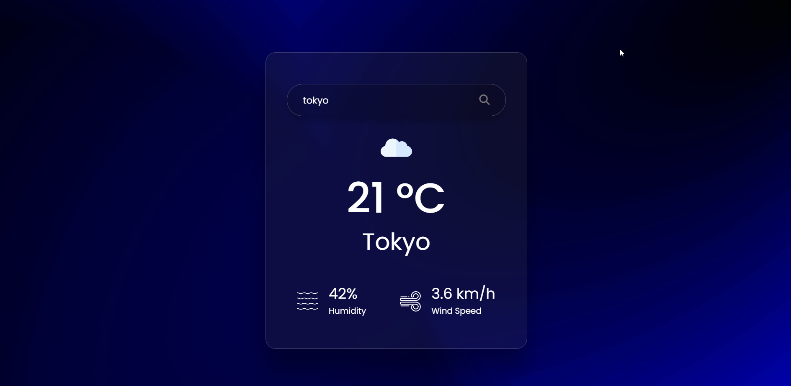

# Weather App

## Introduction

This Weather App is a simple and responsive web application that provides users with current weather information. Built using HTML, CSS, and JavaScript, the app offers an intuitive user interface for checking weather conditions. The project utilizes the OpenWeatherMap API to fetch real-time weather data.

## Features

- **Responsive Design**: The app is designed to adapt to various screen sizes, providing a seamless experience on both desktop and mobile devices.

- **Simple UI**: The user interface is kept minimalistic and user-friendly, allowing users to quickly access weather information without unnecessary complexity.

## UI / Output

## Live Demo

> __LIVE LINK:__ [Click Here](https://yuvrajshrirame.github.io/javascript-projects/03-weather-app/index.html "Open Password Generator Project")

If you have any suggestions or feedback, please don't hesitate to reach out.