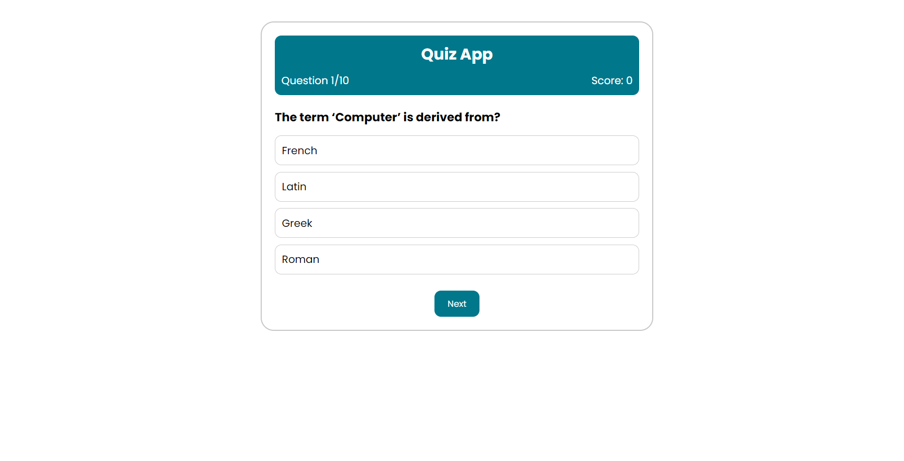

# Quiz App

## Introduction

The Quiz App is a simple web application created using HTML, CSS, and JavaScript. It provides users with a minimalistic and user-friendly interface for taking quizzes, allowing them to select the correct options and check their results instantly.

## Features

- **Selecting Correct Option**: Users can choose their answers by selecting the correct options provided for each quiz question.

- **Results Checking**: The app provides instant feedback, allowing users to check their quiz results immediately after submitting their answers.

## UI / Output

## Live Demo

> __LIVE LINK:__ [Click Here](https://yuvrajshrirame.github.io/javascript-projects/05-quiz-app/index.html "Open Quiz App Project")

If you have any suggestions or feedback, please don't hesitate to reach out.